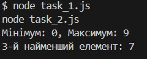

# goit-algo2-hw-01

# Домашнє завдання: "Розділяй і володарюй"

## ✅ Завдання 1: Пошук мінімального та максимального елемента

**Опис:**

- Реалізовано рекурсивну функцію `findMinMax()`, яка знаходить мінімум та максимум у масиві чисел.
- Використано метод "розділяй і володарюй".
- Складність алгоритму: O(n).

**Приклад запуску:**

node task_1.js

Очікуваний вивід:

Мінімум: 0, Максимум: 9

## ✅ Завдання 1:(опціональне): Пошук k-го найменшого елемента

**Опис:**

Реалізовано алгоритм quickSelect() для пошуку k-го найменшого елемента.

Засновано на принципі QuickSelect (вибір опорного елемента без повного сортування).

Середня складність: O(n).

**Приклад запуску:**

node task_2.js

Очікуваний вивід:

3-й найменший елемент: 7

РЕЗУЛЬТАТ ДВОХ ЗАВДАНЬ:

📁 Структура проєкту

.
├── task_1.js
├── task_2.js
└── README.md
